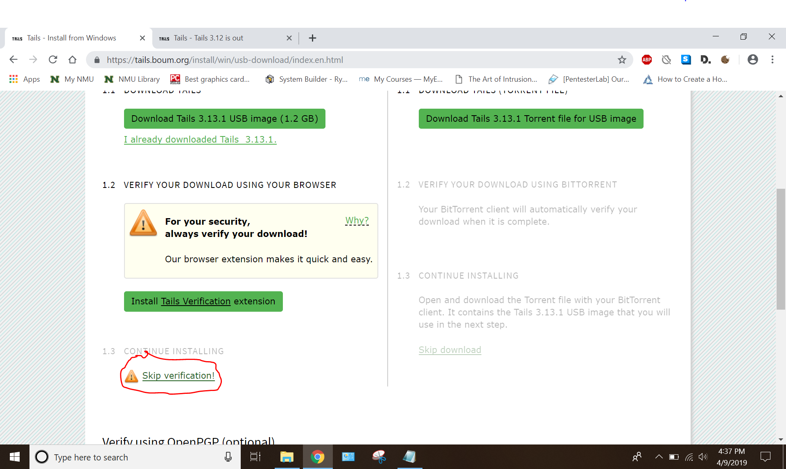

= Installing Tails from Windows

Author: Katie Hildebrand

== Getting Started with Tails

This tutorial will be about installing the operating system "Tails" from Windows. The developers of Tails recently changed the entire installation process for Tails, making it much easiest and faster. So we will go over that new installation process, as well as how to get connected to the internet in Tails and get Tor running. 
+
'''
. By the end of this tutorial, you will be able to:
+
'''
+
'''
* Install Tails from Windows onto a flashdrive.
* Connect to the Internet from Tails
* Start the Tor browser 
+
'''

== Prerequisites

. Windows computer (Windows 7 or later)
+
'''
Tails can be, and some would say should be, installed using Linux systems, but this tutorial will be about using Windows. 
+
'''
. One flashdrive, at least 8 GB. 
+
'''
Installing Tails from Windows used to require two flashdrives, but this new installation method means that only one is now required.
+
'''
. Fast, stable internet connection. 

== Instructions

. Go to Tail's website: https://tails.boum.org/install/index.en.html
. Click "Windows". 
. On the right site of the screen, click the "Install from Windows" button. 
. Click "Let's go!"
. On the left side of the screen, click "Download Tails 3.13.1 USB image (1.2 GB)".
. We're going going to trust the file, and skip verification. Click "Skip verification". 
+

. Click the "Download Etcher for Windows" link. 
. Make sure your flashdrive is plugged in and working. 
. Once the download is complete, open Etcher. 
. Click the blue "Select image" button, and choose the USB image you downloaded in step 5.
. Etcher should detect your flashdrive, but if not, make sure to select the one you want. 
. WARNING!!! THIS WILL WIPE ALL EXISTING DATA ON YOUR FLASHDRIVE! 
. Click "Flash".
. Wait for the install to complete, then restart your computer. This time, boot to the flashdrive. 
. Press enter on "Tails". 
. When the Tails Greeter appears, keep the default settings and press "Start Tails".
. Congrats! You've installed Tails. Now you just need to connect to the internet. 
. Click the little down arrow in the top right-hand corner. 
. Click "wi-fi not connected".
. Select your Wi-Fi, and enter a password if needed. 
. If your internet has a capture portal, you will need to complete some additional steps. 
+
'''
After connection to the Wifi, go to the top left of the screen where it says "Applications".
Go to the "Internet" section, and open "Unsafe Browser". (Unsafe Browser just means that you can be tracked, just like with a normal browser like Chrome.)
Go to a webite, and complete the capture portal. 
Close the Unsafe Browser. It may take some time to close, so just leave it alone for a few minutes. 
+
'''
. When you get a notification saying "Tor is ready" then you are connected to the Internet and ready to go!
. Open Tor, and begin browser. 
+
'''
Notes: Tails does not retain any information between boots. This is what makes it so secure. So do not store anything on Tails and expect it to be there the next time you boot. 
You will also need to re-enter any WiFi passwords/Capture Portals for every boot.
+
'''

== Challenge

. Explore Tails, and find some useful features that come with default Tails. 
. Open Tor, and play with the security settings. 

== Reflection

. What makes Tails a useful operating system?
. What kind of person would be interesting in using Tails? 
. Are there any other browsers to use besides Tor? 

